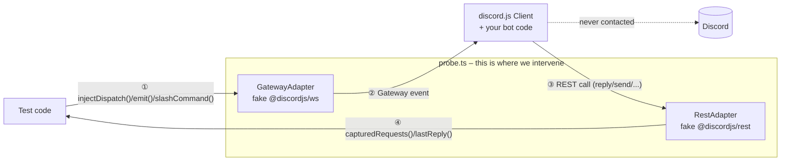

probe.ts is a lightweight testing framework for [discord.js](https://discord.js.org/) bots, built to make testing commands, components, and events fast, deterministic, and completely offline.

## Overview

Testing Discord bots today is painful: either you don't test at all (and find bugs live, in front of real users), or you hand-mock every discord.js model — fragile, and it breaks on every discord.js update.

probe.ts solves this at the transport layer instead: it fakes only the two boundaries of discord.js (`@discordjs/ws` and `@discordjs/rest`), never the model classes. discord.js builds real `Message`/`Interaction`/`GuildMember` objects from the faked data, so your bot code runs completely unmodified — no test Discord server, no network, tests run in milliseconds. Built for hobby and small-team bot developers who want reliability without a steep learning curve.

## Key Features

- Test **Slash Commands** — including options, `deferReply()`/`editReply()`
- Test **Buttons**, **Select Menus**, and **Modals** — including discord.js's own collectors (`awaitMessageComponent()`, `awaitModalSubmit()`, ...)
- Test **Gateway Events** — member join/leave, message create/delete, reactions, prefix commands
- Evaluate **Components V2 containers** with `extractText()` — no manual tree-walking
- **Seamless integration** with discord.js — real model objects, no hand-written mocks
- **Vitest-native** — no separate test runner or assertion library to learn
- Fixture builders with sensible defaults, everything overridable
- Open-source and actively developed

## Installation

```bash
npm install --save-dev probe.ts vitest
# or
yarn add -D probe.ts vitest
```

## Quick Start Example

### Bot Setup

```ts
// bot.ts
import { Client, GatewayIntentBits } from "discord.js";

export function createPingBot(): Client {
  const client = new Client({ intents: [GatewayIntentBits.Guilds] });

  client.on("interactionCreate", async (interaction) => {
    if (interaction.isChatInputCommand() && interaction.commandName === "ping") {
      await interaction.reply("🏓 Pong!");
    }
  });

  return client;
}
```

### Test Setup

```ts
// bot.test.ts
import { createProbe } from "probe.ts";
import { createPingBot } from "./bot.js";

const probe = createProbe(createPingBot());
await probe.setup();

await probe.slashCommand("ping").invoke();

expect(probe.lastReply()).toMatchObject({ content: "🏓 Pong!" });

await probe.teardown();
```

## Testing Gateway Events

```ts
probe.emit("guildMemberAdd", { user: { username: "anna" } });

await vi.waitFor(() => {
  expect(probe.capturedRequests()).toHaveLength(1);
});
```

Supports `guildMemberAdd`/`Remove`, `messageCreate`/`Delete`, and `messageReactionAdd`/`Remove`. Prefix commands (`!ping`) aren't a separate event — they're just a `messageCreate` with matching content. Full guide: [`docs/testing-event-handlers.md`](docs/testing-event-handlers.md).

## Testing Message Components

```ts
await probe.button("open-feedback-modal").click();
await probe.selectMenu("color-select").withValues(["green"]).select();
await probe.modal("feedback-modal").withFields({ "feedback-text": "more coffee please" }).submit();

expect(probe.lastModal()).toMatchObject({ customId: "feedback-modal" });
```

Works with discord.js's own collectors too. Full guide: [`docs/testing-message-components.md`](docs/testing-message-components.md).

## How It Works

probe.ts fakes exactly two boundaries — everything else is real discord.js:



### Terminology

- **Probe**: the object returned by `createProbe(client)` — your interface to inject events and read captured REST calls
- **GatewayAdapter**: fake `@discordjs/ws` — injects raw Gateway dispatch payloads
- **RestAdapter**: fake `@discordjs/rest` — captures outgoing REST calls instead of sending them
- **Fixture**: a builder that produces a raw Gateway/REST payload with sensible, overridable defaults

Architecture deep-dive: every `src/` subfolder has its own `README.md`; overall contributor context lives in `CLAUDE.md`.

## Integration with discord.js

probe.ts works with discord.js v14+. You can integrate it without modifying your existing command or event handling structure — your bot code runs completely unchanged.

## Current Status

**Implemented:** Slash Commands, Buttons/Select Menus (string-select)/Modals with collectors, the gateway events listed above, Components V2 container evaluation.

**Not yet supported:** custom Vitest matchers, other select-menu types (user/role/mentionable/channel), a message-bound `createMessageComponentCollector()` (channel-wide collectors work today), embed snapshot testing, multi-user simulation, permission/role simulation.

⚠️ **Pre-release.** probe.ts is freshly built and not yet battle-tested at scale — the public API may still change before a stable `v0.1.0`. Feedback and bug reports are very welcome.

## Use Cases

- Testing Slash Commands, Buttons, Select Menus, and Modals without a live bot
- Regression-testing event handlers (welcome messages, reaction roles, prefix commands)
- Fast, deterministic CI checks for discord.js bots
- Catching breaking discord.js updates before they reach production

## License

MIT © 2026 GalaxyBot
