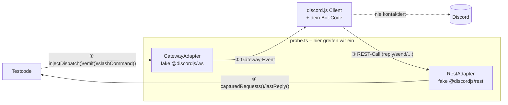

# 🛰️ probe.ts

Testframework für [discord.js](https://discord.js.org)-Bots. Testet Slash
Commands, Buttons/Select-Menus/Modals und Gateway-Events (Member-Join,
Message-Create, ...), **ohne** sich mit Discord zu verbinden – schnell,
deterministisch, integriert in [Vitest](https://vitest.dev).

Teil des GalaxyBot-Ökosystems.

## Warum probe.ts?

Discord-Bots zu testen ist heute unangenehm: entweder gar nicht (Bugs
fallen erst live bei echten Nutzern auf), oder man baut jedes
discord.js-Model von Hand nach – fragil, und bricht bei jedem
discord.js-Update aufs Neue.

probe.ts löst das am Transport-Layer (siehe Kern-Prinzip unten): Commands
und Events lassen sich testen wie normale Funktionen, ohne Netzwerk, ohne
Test-Discord-Server, in Millisekunden statt Sekunden. Gebaut für Hobby-
und Freizeit-Bot-Entwickler mit TypeScript + discord.js – einfacher
Einstieg, vertraute Tools, keine steile Lernkurve.

**Kein Ersatz für:** Vitest (wir integrieren uns, ersetzen nichts), echtes
End-to-End-Testing gegen die Discord-API (anderes Problem), andere
Bot-Libraries als discord.js (erstmal).

## Kern-Prinzip

probe.ts mockt discord.js **nie** an den Model-Klassen (`Message`,
`Interaction`, `Guild`, ...). Stattdessen faked es nur die zwei Grenzen von
discord.js – `@discordjs/ws` (eingehende Gateway-Events) und
`@discordjs/rest` (ausgehende REST-Calls). discord.js baut daraus selbst
echte Model-Objekte; dein Bot-Code läuft unverändert.



Details: `src/transport/README.md`.

## Installation

```bash
npm install --save-dev probe.ts vitest
```

## Quickstart

```ts
import { createProbe } from "probe.ts";
import { createPingBot } from "./bot.js";

const probe = createProbe(createPingBot());
await probe.setup();

await probe.slashCommand("ping").invoke();

expect(probe.lastReply()).toMatchObject({ content: "🏓 Pong!" });

await probe.teardown();
```

Mit Optionen:

```ts
await probe.slashCommand("echo").withOptions({ message: "hallo" }).invoke();
```

## Gateway-Events testen

```ts
probe.emit("guildMemberAdd", { user: { username: "anna" } });

await vi.waitFor(() => {
  expect(probe.capturedRequests()).toHaveLength(1);
});
```

Unterstützt aktuell `guildMemberAdd`, `guildMemberRemove`,
`messageCreate`, `messageDelete`, `messageReactionAdd`,
`messageReactionRemove` – Prefix-Commands (`!ping`) sind dabei kein
eigenes Event, sondern ganz normales `messageCreate` (siehe
`docs/testing-event-handlers.md`). Ausführlich (inkl. der versteckten
discord.js-Regel, dass Guild/Channel/Member/Message vorher im Cache
bekannt sein müssen): `docs/testing-event-handlers.md`.

## Buttons, Select Menus, Modals testen

```ts
await probe.button("open-feedback-modal").click();
await probe.selectMenu("color-select").withValues(["gruen"]).select();
await probe.modal("feedback-modal").withFields({ "feedback-text": "mehr Kaffee bitte" }).submit();

expect(probe.lastModal()).toMatchObject({ customId: "feedback-modal" });
```

Funktioniert auch mit discord.js' eigenen Collectors
(`awaitMessageComponent()`, `awaitModalSubmit()`, ...). Ausführlich:
`docs/testing-message-components.md`.

Antwortet dein Bot mit einem Components-V2-Container statt einfachem
`content`? `extractText(reply)` liest den sichtbaren Text unabhängig vom
Stil aus:

```ts
expect(extractText(probe.lastReply()!)).toBe("🟢 Alle Systeme laufen\nUptime: 3 Tage");
```

## Beispiele

- `examples/ping-bot/` – Slash Commands (`ping`/`echo`/`slow`,
  inkl. `deferReply()`/`editReply()`)
- `examples/welcome-bot/` – Gateway-Events (Willkommensnachricht bei
  `guildMemberAdd`)
- `examples/feedback-bot/` – Button → Modal → Submit (mit Collectors) +
  Select Menu
- `examples/reaction-role-bot/` – Prefix-Command + Reaction-Role
  (`messageReactionAdd`/`messageReactionRemove`)
- `examples/status-bot/` – Antwort als Components-V2-Container
  (`extractText()`)

## Architektur

```
src/
  core/           Probe-Instanz, Lifecycle – der öffentliche Einstiegspunkt
  transport/      Fake-WS-Layer + Fake-REST-Layer (die einzigen zwei Mocks)
  fixtures/       Builder für rohe Gateway-/REST-Payloads
  events/         probe.emit() – generische Gateway-Events
  interactions/   Slash-Command-/Button-/Select-Menu-/Modal-Helfer
```

Jeder Ordner hat sein eigenes `README.md` mit Details zu Zweck,
Konventionen und Erweiterungspunkten. Gesamtkontext für Mitentwickler
(auch KI-Agenten): `CLAUDE.md`.

## Umfang

**Implementiert:**

- Slash Commands, inkl. Optionen, `deferReply()`/`editReply()`
- Buttons, Select Menus (String-Select), Modals – inkl. discord.js'
  eigener Collectors (`awaitMessageComponent()`, `awaitModalSubmit()`, ...)
- Gateway-Events: `guildMemberAdd`/`Remove`, `messageCreate`/`Delete`,
  `messageReactionAdd`/`Remove`
- Prefix-/Message-Commands (kein eigenes Event – ganz normales `messageCreate`)
- Components-V2-Container auswertbar (`extractText()`)

**Noch nicht unterstützt:**

- Custom Vitest-Matcher (z.B. `toHaveReplied`) – aktuell nur Assertions
  auf `lastReply()`/`allReplies()`/etc.
- Weitere Select-Menu-Typen (User-/Role-/Mentionable-/Channel-Select) –
  nur String-Select
- `message.createMessageComponentCollector()` (an eine *bestimmte*
  Nachricht gebunden) – Channel-weite Collectors funktionieren, siehe
  `docs/testing-message-components.md`
- Snapshot-Testing für Embeds, Zeit-/Timer-Kontrolle für Collectors,
  mehrere simulierte Nutzer pro Test, Permissions-/Rollen-Simulation,
  Autocomplete-Helfer

Noch kein stabiles `v0.1.0`; die öffentliche API kann sich bis dahin noch
ändern. `package.json` bleibt bewusst bei `version: "0.0.0"` – die echte
Version setzt `.github/workflows/release.yml` beim Release automatisch
aus dem Git-Tag.

Willst du mitentwickeln? Architektur, Konventionen und offene Punkte:
`CLAUDE.md`.

## Lizenz

MIT – siehe `LICENSE`.
